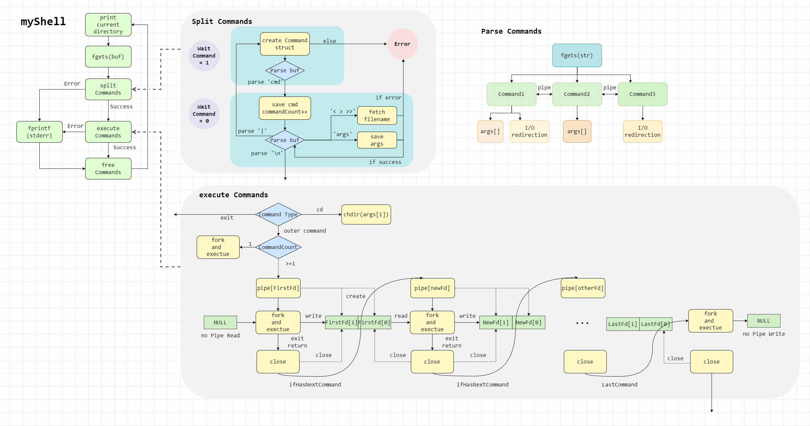

# 一、功能概述
## 1.1 高亮提示

- myShell运行的起始提示
- 命令提示符前`Musel's shell`的前缀标识
- 当前路径提示
- Error的报错提示

## 1.2 cd切换目录


## 1.3 标准I/O重定向


## 1.4 可变长参数命令的运行


## 1.5 管道连接多条命令


## 1.6 管道、重定向、命令格式的错误检查


## 1.7 exit退出myShell


## 1.8 malloc与free
- 管道连接命令数、命令参数个数、参数长度均不定长，所以使用malloc申请存储空间，避免内存浪费。
- 单条命令执行完后调用free释放命令申请的空间，防止内存泄漏。

# 二、系统调用
在第三部分会结合具体功能具体阐述系统调用。此处作简要汇总：
- 获取当前目录：`path = getcwd(NULL, 0)`
- 切换工作目录：`chdir(command->args[1])`
- 创建进程：`pid_t pid = fork()`
- 打开文件描述符表：`open(command->read, O_RDONLY, 0666)`
- 复制文件描述符表：`dup2(in, 0)`
- 执行程序：`execvp(command->cmd, command->args)`
- 父进程等待子进程退出：`wait(&status)`
- 父进程获取子进程退出状态：`WIFEXITED(status)`
- 创建与关闭管道：`pipe(fd);close(fd[0]);`
- 退出进程：`exit(0)`


# 三、功能实现与流程图



## 3.1 宏定义
### 3.1.1 单行命令的输入与解析规模
```c
#define ARGS_COUNT 8        //单条命令的参数个数
#define COMMANDS_COUNT 8    //管道连接的命令个数
#define BUF_SIZE 128        //单行命令的字符数
```
### 3.2.2 命令格式的错误检查
```c
#define ERROR_EMPTY(errorStr)       //起始或管道符号后未输入合法命令
#define ERROR_STR                   //字符串格式错误，后引号丢失
#define ERROR_FORK                  //创建子进程失败
#define ERROR_OPEN                  //重定向的读文件不存在
#define ERROR_EXECUTE(errorCmd)     //命令执行失败：命令类型或参数不合法
#define ERROR_EXIT                  //子进程退出失败
```


## 3.2 打印当前路径
`print_current_directory()`函数调用`path = getcwd(NULL, 0)`获取当前工作目录。

## 3.3 拆分管道连接的多条命令和重定向文件名


- fgets获取输入、malloc命令结构体、标志本次输入的命令条数为1
- `splitCommands(buf, commands)`
  - 初始化命令结构体：
    - 标志状态为**等待命令**，即`waitCommand`置位：此时如果接受到管道符号、重定向符号、字符串、回车终止符均会由相关宏抛出ERROR_EMPTY
    - 初始化本条命令的结构体
    - malloc申请参数数组
  - 识别到命令
  - 持续识别本条命令的命令参数与重定向标志，直到管道符号或回车符
    - 可识别的命令参数：无特殊符号的字符串、单双引号标志的字符串。记录在args参数数组中。
    - 重定向标志：识别到`< > >>`后调用`fetchFileName()`识别重定向文件名，记录在命令结构体中。如果文件格式不对会由相关宏抛出ERROR_IOFILE
  - 识别到管道符号
    - 标记本条命令的参数数组的最后一个参数(*args)为NULL。目的是便于execvp(command)和free(commands)。
    - 命令条数++
    - 初始化下一条命令结构体，继续读取下一条命令
  - 识别到回车符：
    - 标记本条命令的参数数组的最后一个参数`(*args) = NULL`。
    - 标记命令数组的最后一个命令`commans->cmd = NULL`。目的是便于`execvp(command)`和`free(commands)`。

## 3.4 如果拆分命令未出现异常，逐条执行命令commands

### 3.4.1 逐条执行指令，使用管道连接父子进程数据
`executeCommands(commands)`
- 命令数commandsCount = 1：
  - 不用创建管道，不从pipe读取重定向I/O，fd_in和fd_out为-1
  - `forkToExecute(commands,-1,-1)`创建子进程并执行
- 命令数commandsCount = 2：
  - 此时重定向方向为：第一条命令写 -> 第二条命令读。故创建一条管道`pipe(fd);`即可；
  - 为第一条指令创建子进程，执行第一条指令的子进程不使用此管道的读指针（没有前序命令为此命令提供输入），fd_in设置为-1；使用写指针fd[1].
  - 第一条指令结束后其子进程退出。父进程关闭此管道的fd[1],释放第一条指令结构体。
  - 父进程为第二条指令创建子进程，执行第二条指令的子进程使用此管道的读指针fd[0]，不使用此管道的写指针（没有后续命令需要此命令的输出），fd_out设置为-1。
  - 第二条指令结束后其子进程退出。父进程关闭此管道的fd[1],释放第二条指令结构体。
- 命令数commandsCount > 2: 
  - 与上述大致相同，基本遵循：**pipe()->fork()->execute()->close()->free()**
  - 多命令的管道：需要保证两条管道同时开启：
    ```c
        int *pipes[2];
        pipes[0]=(int *)malloc(sizeof(int)*2);
        pipes[1]=(int *)malloc(sizeof(int)*2);
        int newPoint = 0;
        pipe(pipes[newPoint]);
        forkToExecute(commands,-1,(pipes[newPoint])[1]);
        close((pipes[newPoint])[1]);
        freeCommand(commands++);
    
        for (int i = 1; i < (commandsCount - 1); ++i) {
            newPoint = 1-newPoint;
            
            pipe(pipes[newPoint]);
            forkToExecute(commands,(pipes[1-newPoint])[0],(pipes[newPoint])[1]);
            close((pipes[1-newPoint])[0]);
            close((pipes[newPoint])[1]);
            freeCommand(commands++);
        }
    
        forkToExecute(commands,(pipes[newPoint])[0],-1);
        close((pipes[newPoint])[0]);
        freeCommand(commands);
    
    ```
    
#### 关于pipe(),close()与fork()父子进程的理解：
> (由于网上资料并不多，以下仅为根据程序的运行结果做出的个人理解,正确性未知)
##### pipe(int fd[2])：
- malloc是用户区的申请。而pipe类似于**内核区域**的malloc。
- pipe相当于在内核缓冲区**申请**一片空间，用于存放数据。类似多线程生产者消费者模式的table，供不同线程不同时间的读取。
##### int fd[2]：
- fd为**内核缓冲区指针**的数组，fd[0]为此缓冲区的**读指针**，fd[1]为**写指针**。
##### close()
- 在内核缓冲区申请的空间的**释放**：需要**两个条件**，即**四次操作**：
  - 一次pipe得到的空间，**只允许发生且必须发生**一次读和一次写。
  - 必须在读后关闭读指针close(fd[0]);必须在写后关闭写指针close(fd[1]);
  - 完成上述条件后，此段空间自动释放。
##### fork()
- 一个进程创建pipe(int fd[2])，只供自己读取是没有意义的，因为可以在用户区malloc也能实现同等效果。pipe一般**与fork()**配合使用，目的是用于不同进程之间的数据传输。
- 学过OS的进程管理以后非常容易理解：因为不同进程自身占用各自的用户区虚拟空间，而**不同进程**之间**共享**相同的**内核**虚拟空间。一个**进程结束**后，自身**用户区**的虚拟空间中的数据随之**消失**。
- 那么pipe的应用场景是，当一个进程运行后产生数据后就消亡。而另一个进程在**上个进程消亡后**才开始运行，需要获取上个进程运行的数据。这时候上个进程的数据只能**写入内核区**才能保存，即在**地址fd[1]**写数据。
- 造成此种应用场景的原因是:
  - ① Linux支持的众多指令是靠**调用内核程序**实现的。所以当shell把用户命令解析出命令和命令参数后，通过c库函数`execvp(command->cmd, command->args)`等实现调用内核程序的效果。该函数成功执行后，**调用此函数的进程结束**，此函数的后续指令并不会再运行。
  - ② c语言用于并行操作的**fork函数**。其模式是这样的：所以可以看到，当子进程调用执行函数执行命令后，子进程消亡。父进程需要等待子进程结束后再工作。   
    ```c
    pid_t pid = fork();
    if (pid < 0) { 
            //子进程创建失败，不会进入此分支 
        }
    else if (pid == 0) {
            //子进程创建成功，进入此分支。
            //此分支执行子进程操作
            Execute and Write (to fd[1] in kernel buffer);
    } else {
            //由于fork()函数有两个返回值
            //所以如果子进程创建成功，进入上个分支后，也会进入这个分支
            //此分支执行父进程操作
            Wait;
            Fetch Data (from fd[0] in kernel buffer) and continue;
    }
    ```
##### close()的时机
- 父进程在fork()前pipe(fd)，fork()后父子进程共享相同的fd。
    - 子进程执行时写fd[1]。返回到父进程时由父进程close(fd[1]).
    - 父进程再次创建新的子进程执行下一条指令，子进程执行时读fd[0]。如果此命令后续还有指令，那么子进程再写另一条新管道的newfd[1].子进程执行完毕返回到父进程时，由父进程close(fd[0]).至此fd的缓冲区完成两次关闭和一写一读，被释放。由于已经写过新管道的newfd[1]，此时父进程也要close(newfd[1]).
    - 原则是创建新进程前pipe，子进程负责读写fd，父进程负责关闭fd。


### 3.4.2 创建子进程，执行单条指令
`forkToExecute(Command *command, int fd_in, int fd_out)`
- exit : 释放命令结构体并退出shell
- cd ：系统调用`chdir(command->args[1])`切换工作目录
- 外部命令：
  - fork()创建子进程
  - command结构体中读出重定向文件：`int open(const char *pathname, int oflag, [mode_t mode])`系统调用获得文件描述符表
  - 重定向：`dup2(in, 0);dup2(out, 1);`
  - 子进程运行命令`execvp(command->cmd, command->args)`
  - 父进程等待子进程结束后运行下一条命令

## 3.5 释放本次输入的commands数组，等待用户的下一次输入

